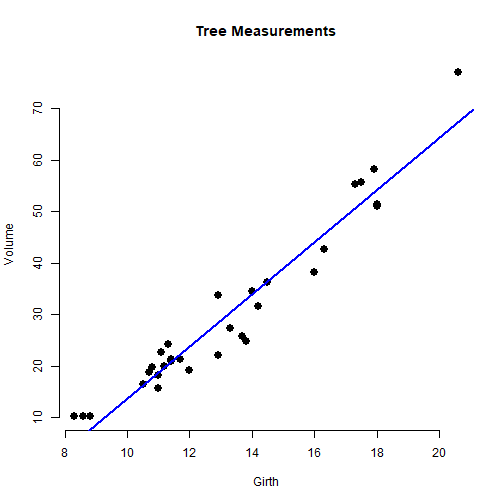
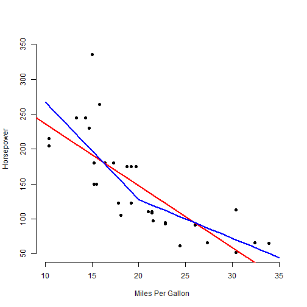
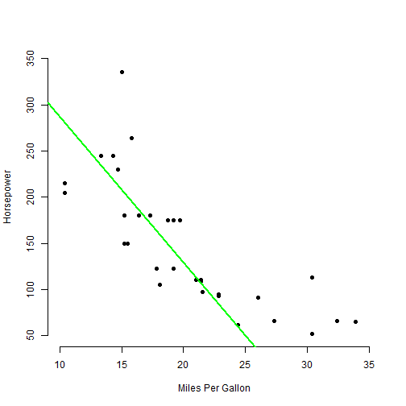
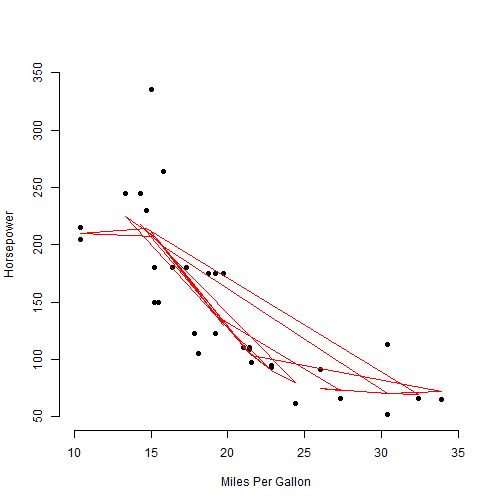

Prediction Application Presentation
========================================================
author: Mike Foo
date: 20-April-2021
autosize: true
font-import: http://fonts.googleapis.com/css?family=Risque
font-family: 'Risque'
css: custom.css

Introduction
========================================================
transition: rotate

~~This application allow a user to explore linear prediction on:~~

- Trees data
- mtcars data

The plot in each tab allows users to freely manipulate the data points. on

Tabs Description
========================================================
transition: concave
type: exclaim

There is a total of 4 tabs

- Tab 1 - Tree data prediction by highlighting input data point
- Tab 2 - two linear prediction on mtcars data with slider input
- Tab 3 - linear prediction on mtcars data by highlighting input data point
- Tab 4 - SVM (support vector machine) prediction on mtcars data by highlighting input data point

Tab 1 and Tab 2 plot sample
========================================================
transition: zoom

Tab 1 plot example

***

Tab 2 plot example 

Tab 3 and Tab 4 plot sample
========================================================
transition: fade
type: exclaim

Tab 3 example plot

***
Tab 4 example plot

<!-- Here's what you need -->
<!-- https://support.rstudio.com/hc/en-us/articles/200486468 -->

<!-- 5 slides to pitch our idea done in Slidify or Rstudio Presenter -->
<!-- Your presentation pushed to github or Rpubs -->
<!-- A link to your github or Rpubs presentation pasted into the provided text box -->
<!-- Your presentation must satisfy the following -->

<!-- It must be done in Slidify or Rstudio Presenter -->
<!-- It must be 5 pages -->
<!-- It must be hosted on github or Rpubs -->
<!-- It must contained some embedded R code that gets run when slidifying the document -->

<!-- Your Reproducible Pitch -->

<!-- Was the presentation completed in slidify or R Presenter? -->
<!-- Was it 5 pages? -->
<!-- Did it contain an R expression that got evaluated and displayed? -->
<!-- Was it hosted on github or Rpubs? -->
<!-- Was the server calculation displayed in the html page? -->
<!-- Here's your opportunity to give this presentation a +1 for being well done. Did they tinker around with the default style? Was the presentation particularly lucid and well organized? In other words, the student made a legitimate try. -->
<!-- There were no R errors displayed in the presentation. -->
